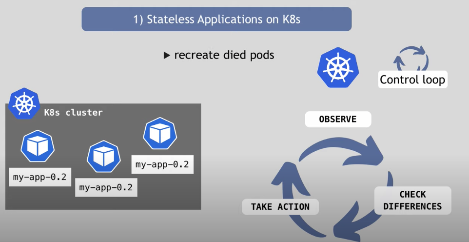
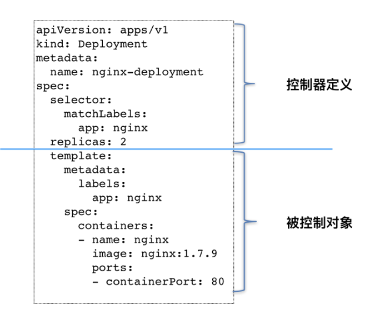
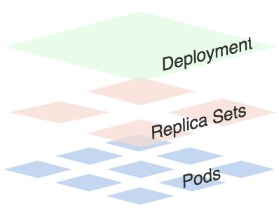

## Controller控制器对象
Pod 这个看似复杂的 API 对象，实际上就是对容器的进一步抽象和封装而已。

“容器”镜像虽然好用，但是容器这样一个“沙盒”的概念，对于描述应用来说，还是太过简单了。这就好比，集装箱固然好用，但是如果它四面都光秃秃的，吊车还怎么把这个集装箱吊起来并摆放好呢？

所以，Pod 对象，其实就是容器的升级版。它对容器进行了组合，添加了更多的属性和字段。
这就好比给集装箱四面安装了吊环，使得 Kubernetes 这架“吊车”，可以更轻松地操作它。

总结构图


### Deployment控制器
```
apiVersion: apps/v1
kind: Deployment
metadata:
  name: nginx-deployment
spec:
  selector:
    matchLabels:
      app: nginx
  replicas: 2
  template:
    metadata:
      labels:
        app: nginx
    spec:
      containers:
      - name: nginx
        image: nginx:1.7.9
        ports:
        - containerPort: 80
```
携带了app=nginx标签的Pod的个数，永远为 spec.replicas = 2

kubernetes哪个组件执行操作? controller-manager 的组件。

查看kubernetes项目在controller目录

```
$ cd kubernetes/pkg/controller/
$ ls -d */              
deployment/             job/                    podautoscaler/          
cloud/                  disruption/             namespace/              
replicaset/             serviceaccount/         volume/
cronjob/                garbagecollector/       nodelifecycle/          replication/            statefulset/            daemon/
...
```

所有控制器都遵循kubernetes项目的统一编排模式，**控制循环(controll loop)**



用伪代码来描述：

```
for {
  实际状态 := 获取集群中对象X的实际状态（Actual State）
  期望状态 := 获取集群中对象X的期望状态（Desired State）
  if 实际状态 == 期望状态{
    什么都不做
  } else {
    执行编排动作，将实际状态调整为期望状态
  }
}
```

实际状态来自kubernetes本身。
期望状态来自用户提交的yaml文件

> 关于事件驱动和控制器模式：
> - 事件驱动：对于控制器来说是被动，只要触发事件则执行，对执行后不负责，无论成功与否，没有对一次操作的后续进行“监控”
> - 控制器模式：对于控制器来说是主动的，自身在不断地获取信息，起到事后“监控”作用，知道同步完成，实际状态与期望状态一致


### Deployment部署应用
创建一个yaml文件
```
kubectl create deployment web --image=nginx --dry-run -o yaml > nginx.yaml
```

nginx.yaml 文件内容：

```
# 控制器定义
apiVersion: apps/v1
kind: Deployment
metadata:
  creationTimestamp: null
  labels:
    app: web
  name: web
spec:
  replicas: 1
  selector:
    matchLabels:
      app: web
  strategy: {}

 # 被控制对象
  template:
    metadata:
      creationTimestamp: null
      labels:
        app: web
    spec:
      containers:
      - image: nginx
        name: nginx
        resources: {}
status: {}
```


创建pods：

```
root@van-master:~# kubectl apply -f nginx.yaml
deployment.apps/web created
root@van-master:~# kubectl get pods
NAME                   READY   STATUS    RESTARTS   AGE
nginx                  2/2     Running   0          8m11s
web-5dcb957ccc-hjk4p   1/1     Running   0          17s
```
此时只能在集群内部访问，需要暴露服务

```
root@van-master:~# kubectl expose deployment web --port=80 --type=NodePort --target-port=80 --name=web-exp -o yaml > web-exp.yaml
```

查看pod状态
```
root@van-master:~# kubectl get pods,svc
NAME                       READY   STATUS    RESTARTS   AGE
pod/nginx                  2/2     Running   0          12m
pod/web-5dcb957ccc-hjk4p   1/1     Running   0          4m43s

NAME                 TYPE        CLUSTER-IP       EXTERNAL-IP   PORT(S)        AGE
service/kubernetes   ClusterIP   10.96.0.1        <none>        443/TCP        5h49m
service/web-exp      NodePort    10.102.162.130   <none>        80:30243/TCP   84s
service/web1         NodePort    10.104.185.68    <none>        80:32600/TCP   4m6s
```

访问worker节点服务：
```
van@van-master:~$ curl 192.168.0.102:32600
<!DOCTYPE html>
<html>
<head>
<title>Welcome to nginx!</title>
<style>
    body {
        width: 35em;
        margin: 0 auto;
        font-family: Tahoma, Verdana, Arial, sans-serif;
    }
...
```

## Deployment原理

- Deployment 控制器从 Etcd 中获取到所有携带了“app: nginx”标签的 Pod，然后统计它们的数量，这就是实际状态；
- yaml文件中replicas的值就是期望状态
- reconcile loop, Sync loop.

第三个状态是调谐，即增加pod，删除pod，更新pod某个字段。

这就是一个对象管理另外一个对象的艺术

而被控制对象的定义来自template， 所有被Deployment管理的pod实例，都是根据这个字段来创造出来的。

> 像 Deployment 定义的 template 字段，在 Kubernetes 项目中有一个专有的名字，叫作 PodTemplate（Pod 模板）。这个概念非常重要，大多数控制器都会使用 PodTemplate 来统一定义它所要管理的 Pod。

### 总结
上半部分为控制器定义，即为期望状态
下半部分是被控制对象的模板，如图：



### 那么deployment的控制对象是pod吗？ 答案在这张图中




```
apiVersion: apps/v1
kind: Deployment
metadata:
  name: nginx-deployment
  labels:
    app: nginx
spec:
  replicas: 3
  selector:
    matchLabels:
      app: nginx
  template:
    metadata:
      labels:
        app: nginx
    spec:
      containers:
      - name: nginx
        image: nginx:1.7.9
        ports:
        - containerPort: 80
```

创建这个deployment：
```
kubectl create -f nginx-deployment.yaml --record
```


水平扩展：

```
root@van-master:~# kubectl scale deployment nginx-deployment --replicas=4
deployment.apps/nginx-deployment scaled
```

查看deployment控制的Replica Set
```
root@van-master:~# kubectl get rs
NAME                          DESIRED   CURRENT   READY   AGE
nginx-deployment-5bf87f5f59   4         4         4       3m40s
web-5dcb957ccc                1         1         1       68m
```

